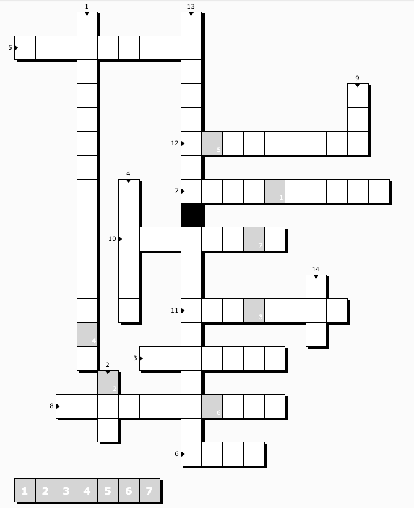

# Kreuzworträtsel

1. Phase, in der Quellcodes generiert werden. (ohne Bindestrich)
2. Format der POM
3. POM steht für _... Object Model_
4. Phase, in der das Artefakt ins Remote Repository abgelegt wird
5. Aneinanderreihung von Phasen (_Build ..._)
6. Aufrufschnittstelle eines Plugins
7. ... over Configuration
8. ... over Inheritance
9. Organisationsstruktur von Repositories
10. Scope für Dependencies, die nicht mit der Anwendung ausgeliefert werden
11. Version, die mehrmals im Repository abgelegt werden kann
12. Eigenschaft von Dependencies (Adjektiv)
13. Prinzip, dass Versionssprüngen eine Bedeutung zugeschrieben wird (engl.)
14. POM mit vorkonfigurierten Dependency-Versionen